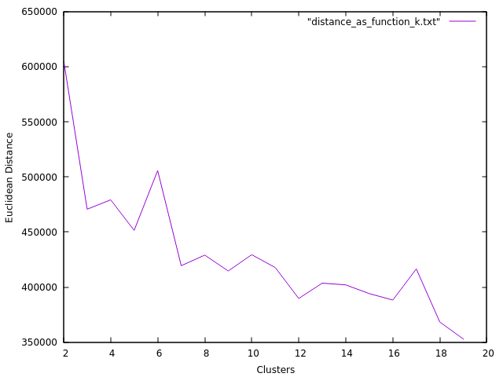

# AI_practice

## Decisions d'implementació

### Búsqueda

* If del isGoalState(). Per què en el bfs i dfs està dins del for i en els algorismes amb costos està abans els for.
*  Per què no cal comprovar que un node està en el fringe o en expand (A* i UCS)

### MaxSAT

* Explicar una mica el maxcut

### Machine learning

#### Decision tree

* Comentar una mica el buildtree iteratiu. (Per què es fa servir una pila? Referència al pare? Com obtenir particions?).
* Per què em fet el cross-validation random
* El mètode ruleta.
* Comentar com funciona el nostre fill missing data

#### K-means

* Comentar perquè a més clusters K, la suma de les distancies als seus items és més petita. Gràfic:

